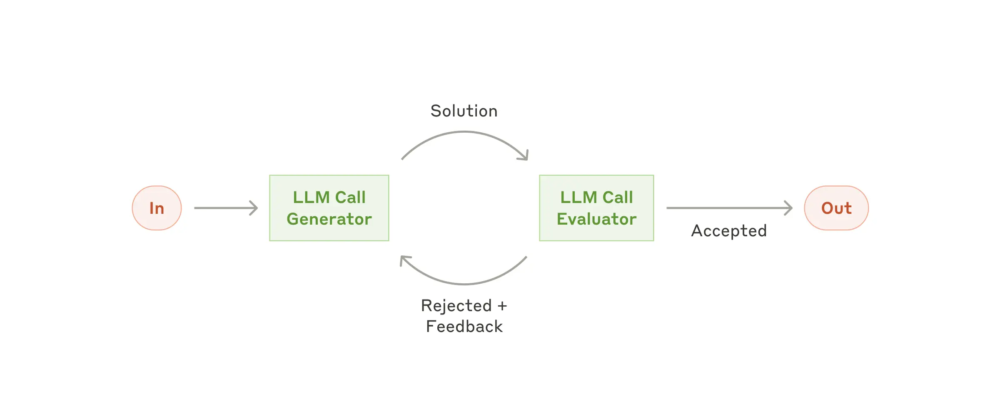

# Building effective agents

> Ref: <https://www.anthropic.com/engineering/building-effective-agents>

## When (and when not) to use agents

Finding the simplest solution possible, and only increasing complexity when needed.
Agentic systems often trade latency and cost for better task performance, and you should consider when this tradeoff makes sense.

Workflows complexity ⬆️ -> predictability and consistency for well-defined tasks ⬆️

Agents ⬆️ -> flexibility and model-driven decision-making ⬆️

For many applications, however, optimizing single LLM calls with retrieval and in-context examples is usually enough.

## When and how to use frameworks

... However:

* They often create extra layers of abstraction that can obscure the underlying prompts ​​and responses, making them harder to debug.
* They can also make it tempting to add complexity when a simpler setup would suffice.

Incorrect assumptions about what's under the hood are a common source of customer error.

## Building blocks, workflows, and agents

### Building block: The augmented LLM

### Workflow: Prompt chaining

This workflow is ideal for situations where the task can be easily and cleanly decomposed into fixed subtasks.

The main goal is to trade off latency for higher accuracy, by making each LLM call an easier task.

### Workflow: Routing

This workflow allows for separation of concerns, and building more specialized prompts. Without this workflow, optimizing for one kind of input can hurt performance on other inputs.

Routing works well for complex tasks where there are distinct categories that are better handled separately, and where classification can be handled accurately, either by an LLM or a more traditional classification model/algorithm.

### Workflow: Parallelization

### Workflow: Orchestrator-workers

In the orchestrator-workers workflow, a central LLM dynamically breaks down tasks, delegates them to worker LLMs, and synthesizes their results.

This workflow is well-suited for complex tasks where you can’t predict the subtasks needed.

The key difference from parallelization is its flexibility—subtasks aren't pre-defined, but determined by the orchestrator based on the specific input.

### Workflow: Evaluator-optimizer

One LLM call generates a response while another provides evaluation and feedback in a loop.

This workflow is particularly effective when we have clear evaluation criteria, and when iterative refinement provides measurable value.

The two signs of good fit are:

* that LLM responses can be demonstrably improved when a human articulates their feedback;
* that the LLM can provide such feedback.

### Agents

Agents can be used for open-ended problems where it’s difficult or impossible to predict the required number of steps, and where you can’t hardcode a fixed path. The LLM will potentially operate for many turns, and you must have some level of trust in its decision-making. Agents' autonomy makes them ideal for scaling tasks in trusted environments.

Example, High-level flow of a coding agent:

## Summary

* Maintain simplicity in your agent's design.
* Prioritize transparency by explicitly showing the agent’s planning steps.
* Carefully craft your agent-computer interface (ACI) through thorough tool documentation and testing.

## Appendix 2: Prompt engineering your tools

One rule of thumb is to think about how much effort goes into human-computer interfaces (HCI), and plan to invest just as much effort in creating good agent-computer interfaces (ACI). Here are some thoughts on how to do so:

* Put yourself in the model's shoes.

    Is it obvious how to use this tool, based on the description and parameters, or would you need to think carefully about it?

    If so, then it’s probably also true for the model. A good tool definition often includes example usage, edge cases, input format requirements, and clear boundaries from other tools.

* How can you change parameter names or descriptions to make things more obvious?

    Think of this as writing a great docstring for a junior developer on your team. This is especially important when using many similar tools.

* Test how the model uses your tools

* Poka-yoke (zh-Hans: "防呆") your tools. Change the arguments so that it is harder to make mistakes.
